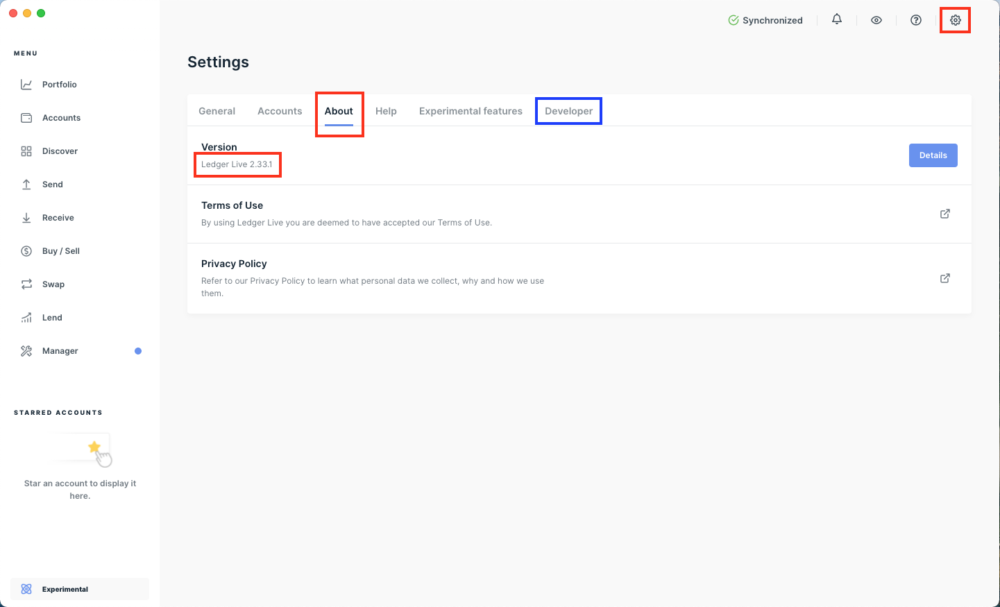
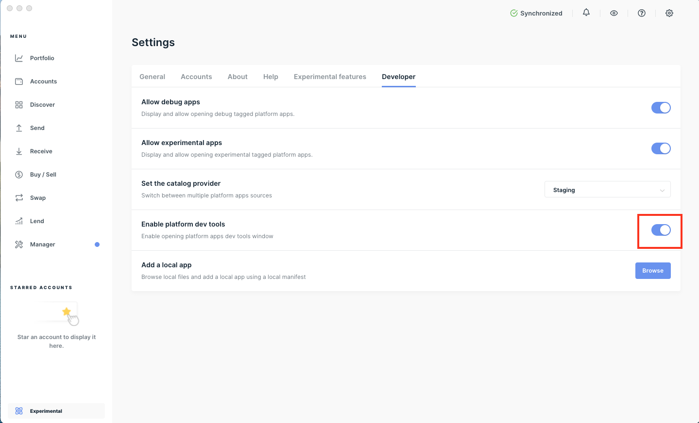
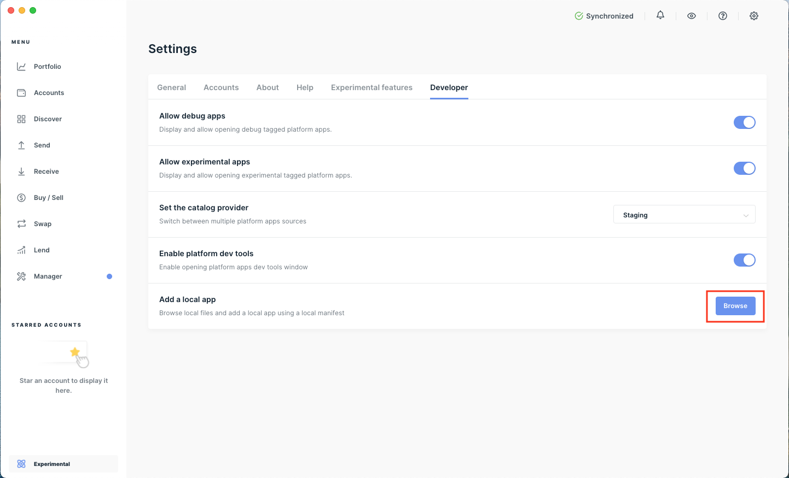
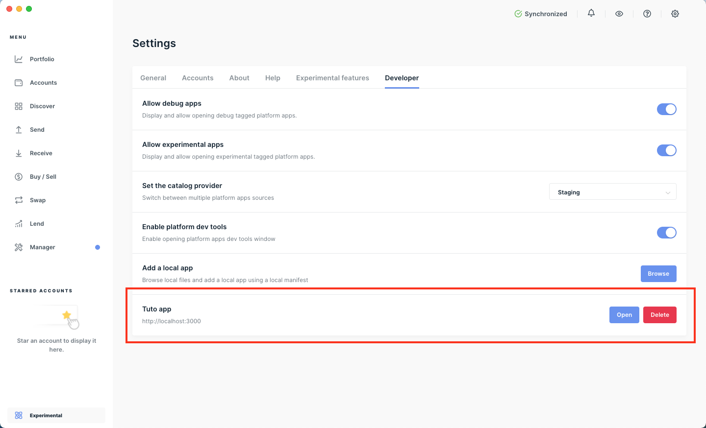

## Import the manifest in Ledger Live

---

If not done already, you must have Ledger Live Desktop installed on your computer. Head over to the [download page](https://www.ledger.com/ledger-live/download) to get started.

In order to add a local manifest to Ledger Live and run a not yet available Live App, you must enable the Developer mode.

To activate the Developer mode in Ledger Live, go to the **Settings** -> **About** section, and click ten times on the Ledger Live version. You will then see a new **Developer** section in the settings menu.

Once done, make sure to turn on **Enable platform dev tools** as it will allow you to open a browser-like developer tools window to inspect your app.

Then click on **Browse** next to **Add a local app** and select the manifest you created in the [previous section](./2-manifest.md).

You will then see a new row in the menu with the name of your Live App.

Now that you have added your Live App in your local Ledger Live application, it’s time to open it and test it. We’ll see this in the next section.

---

⬅️ <code>&nbsp;</code>[Previous](./2-manifest.md) | [Next](./4-test.md)<code>&nbsp;</code>➡️
